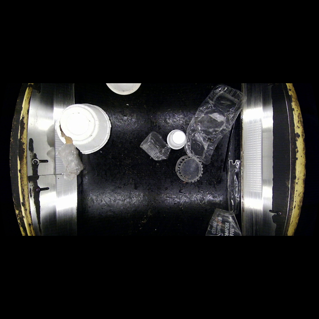
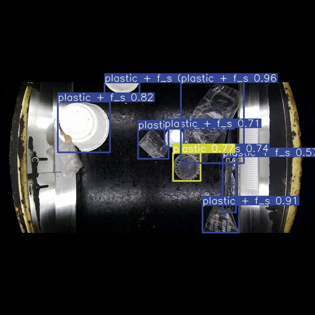

# Object Detection with YOLOv8, MS AI School Team Project

## Waste Detection
 Reduce waste disposal costs and increase recycling rates to contribute to the sustainability of urban environments.  

### My Role : Detection Model Training and Inference  

## Training Result

 

## Demo with streamlit
Visit [This Link](https://ms3-waste-detect.streamlit.app/),
to try Object Detection!  
 

